# Example Voting App

[](https://github.com/opsera-agentic/enterprise-voting-demo-only/actions/workflows/deployment-landscape-voting01.yaml)
[](https://github.com/opsera-agentic/enterprise-voting-demo-only/actions/workflows/ci-build-push-voting01-dev.yaml)

---

## 🚀 Deployment Dashboard

<!-- DEPLOYMENT-STATUS:START - Auto-updated by landscape workflow -->
| Environment | App | Last Deploy | Owner | Recent Deployments |
|-------------|-----|-------------|-------|-------------------|
| 🔧 **DEV** | [Vote](https://vote-voting01-dev.agent.opsera.dev) / [Result](https://result-voting01-dev.agent.opsera.dev) | 1h 33m ago | PIYUSH SRIVASTAVA | • `aff850f-2026` (1h 33m ago) by _PIYUSH SRIVASTA_<br>• `a3933a3-2026` (9h 27m ago) by _srinivas-source_<br>• `175a032-2026` (11h 20m ago) by _srinivas-source_<br>• `ac2ba38-2026` (11h 36m ago) by _PIYUSH SRIVASTA_<br>• `8cf91bf-2026` (11h 56m ago) by _PIYUSH SRIVASTA_ |
| 🧪 **QA** | [Vote](https://vote-voting01-qa.agent.opsera.dev) / [Result](https://result-voting01-qa.agent.opsera.dev) | 9h 26m ago | srinivas-source | • `a3933a3-2026` (9h 26m ago) by _srinivas-source_<br>• `175a032-2026` (11h 19m ago) by _srinivas-source_<br>• `ac2ba38-2026` (11h 34m ago) by _PIYUSH SRIVASTA_<br>• `8cf91bf-2026` (11h 54m ago) by _PIYUSH SRIVASTA_<br>• `0e07861-2026` (12h 31m ago) by _PIYUSH SRIVASTA_ |
| 🎭 **Staging** | [Vote](https://vote-voting01-staging.agent.opsera.dev) / [Result](https://result-voting01-staging.agent.opsera.dev) | 16h 10m ago | srinivas-source | • `e3e1a9b-2026` (16h 10m ago) by _srinivas-source_<br>• `c8886cd-2026` (17h 23m ago) by _srinivas-source_<br>• `7745d6f-2026` (17h 35m ago) by _srinivas-source_<br>• `0961c14-2026` (17h 49m ago) by _srinivas-source_<br>• `bebfee0-2026` (1 day ago) by _srinivas-source_ |

> 📅 _Last updated: 2026-02-04 18:16 UTC_ | [🔄 Refresh](https://github.com/opsera-agentic/enterprise-voting-demo-only/actions/workflows/deployment-landscape-voting01.yaml)
<!-- DEPLOYMENT-STATUS:END -->

### Quick Actions

| Action | Link |
|--------|------|
| 📊 **View Full Landscape Report** | [▶️ Open Dashboard](https://github.com/opsera-agentic/enterprise-voting-demo-only/actions/workflows/deployment-landscape-voting01.yaml) |
| 🔧 Deploy to DEV | [▶️ Run](https://github.com/opsera-agentic/enterprise-voting-demo-only/actions/workflows/ci-build-push-voting01-dev.yaml) |
| 🧪 Deploy to QA | [▶️ Run](https://github.com/opsera-agentic/enterprise-voting-demo-only/actions/workflows/ci-build-push-voting01-qa.yaml) |
| 🎭 Deploy to Staging (Preview) | [▶️ Run](https://github.com/opsera-agentic/enterprise-voting-demo-only/actions/workflows/ci-build-push-voting01-staging.yaml) |
| 🚀 **Promote Staging to Active** | [▶️ Run](https://github.com/opsera-agentic/enterprise-voting-demo-only/actions/workflows/promote-staging-rollout-voting01.yaml) |
| ⬆️ Promote Environment (DEV→QA→Staging) | [▶️ Run](https://github.com/opsera-agentic/enterprise-voting-demo-only/actions/workflows/promote-voting01.yaml) |

---

A simple distributed application running across multiple Docker containers.

## Getting started

Download [Docker Desktop](https://www.docker.com/products/docker-desktop) for Mac or Windows. [Docker Compose](https://docs.docker.com/compose) will be automatically installed. On Linux, make sure you have the latest version of [Compose](https://docs.docker.com/compose/install/).

This solution uses Python, Node.js, .NET, with Redis for messaging and Postgres for storage.

Run in this directory to build and run the app:

```shell
docker compose up
```

The `vote` app will be running at [http://localhost:8080](http://localhost:8080), and the `results` will be at [http://localhost:8081](http://localhost:8081).

Alternately, if you want to run it on a [Docker Swarm](https://docs.docker.com/engine/swarm/), first make sure you have a swarm. If you don't, run:

```shell
docker swarm init
```

Once you have your swarm, in this directory run:

```shell
docker stack deploy --compose-file docker-stack.yml vote
```

## Run the app in Kubernetes

The folder k8s-specifications contains the YAML specifications of the Voting App's services.

Run the following command to create the deployments and services. Note it will create these resources in your current namespace (`default` if you haven't changed it.)

```shell
kubectl create -f k8s-specifications/
```

The `vote` web app is then available on port 31000 on each host of the cluster, the `result` web app is available on port 31001.

To remove them, run:

```shell
kubectl delete -f k8s-specifications/
```

## Architecture


* A front-end web app in [Python](/vote) which lets you vote between two options
* A [Redis](https://hub.docker.com/_/redis/) which collects new votes
* A [.NET](/worker/) worker which consumes votes and stores them in…
* A [Postgres](https://hub.docker.com/_/postgres/) database backed by a Docker volume
* A [Node.js](/result) web app which shows the results of the voting in real time

## 📚 Documentation & Reports

### Deployment Reports
Detailed deployment reports are generated for each significant deployment and stored in the `.deployments/` folder:

| Report | Description |
|--------|-------------|
| [E2E Integration Test v23](/.deployments/2026-02-04-a3933a3-v23-e2e-deployment-report.md) | Full end-to-end integration test with all components (NR, Jira, Slack, Security) |
| [Canary Rollback Test](/.deployments/2026-02-04-175a032-canary-rollback-report.md) | Canary deployment with APM-driven rollback demonstration |
| [Standard Deployment](/.deployments/2026-02-04-e3e1a9b-v17-deployment-report.md) | Complete deployment report with security scanning results |

### Learnings & Best Practices
Technical learnings and integration guides are documented in the `.learnings/` folder:

| Document | Description |
|----------|-------------|
| [Canary Analysis + New Relic Integration](/.learnings/2026-02-04-canary-analysis-nr-integration.md) | Critical fixes for NR Python agent error capture in canary deployments |
| [Session Learnings](/.learnings/2026-02-04-session-learnings.md) | Comprehensive DevOps learnings from production deployments |

### Key Integration Points

```mermaid
flowchart TB
    subgraph CI["CI/CD Pipeline"]
        GHA["GitHub Actions"]
        SEC["🔒 Security Scanning<br/>Gitleaks + Grype"]
        SONAR["📊 SonarQube"]
    end

    subgraph DEPLOY["Deployment"]
        ARGO["🔄 ArgoCD"]
        CANARY["🐤 Canary Analysis"]
    end

    subgraph OBSERVE["Observability"]
        NR["📊 New Relic APM"]
        SLACK["📢 Slack"]
        JIRA["📋 Jira"]
    end

    GHA --> SEC --> DEPLOY
    GHA --> SONAR --> DEPLOY
    DEPLOY --> ARGO --> CANARY
    CANARY --> NR
    NR -->|"Error Rate > 2%"| ARGO
    ARGO -->|"Notifications"| SLACK
    ARGO -->|"Issue Tracking"| JIRA
```



---

## Notes

The voting application only accepts one vote per client browser. It does not register additional votes if a vote has already been submitted from a client.

This isn't an example of a properly architected perfectly designed distributed app... it's just a simple
example of the various types of pieces and languages you might see (queues, persistent data, etc), and how to
deal with them in Docker at a basic level.
